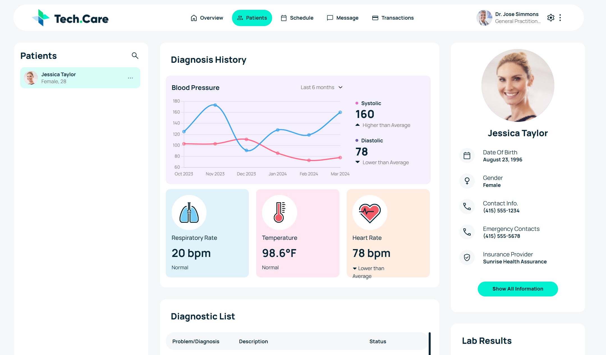

# Tech.Care Patient Dashboard (FED Skills Test)

A single-page, responsive dashboard built from an Adobe XD design. The UI is populated using the Coalition Technologies Patient Data API, showing data for **Jessica Taylor** only, as required by the test instructions.

## Preview



## Features

- Pixel-focused layout based on the provided Adobe XD template
- Data fetched via **GET** request using **Basic Auth** (encoded at runtime, not hardcoded)
- UI populated for **Jessica Taylor**:
  - Patient profile details
  - Diagnosis history vitals
  - Diagnostic list
  - Lab results
- Blood pressure chart rendered using **Chart.js**

## Tech Stack

- HTML5
- CSS3 (Manrope font, pixel-based layout)
- Vanilla JavaScript (Fetch API)
- Chart.js

## Project Structure

```text
techcare/
  index.html
  assets/
    css/
      style.css
    js/
      app.js
    img/
      (icons, svg assets, images)
    screenshots/
      dashboard.png
````

## How to Run Locally

### Option 1: Open directly

1. Download or clone the project
2. Open `index.html` in your browser

### Option 2: Run with a local server (recommended)

Using VS Code:

1. Install the **Live Server** extension
2. Right-click `index.html` → **Open with Live Server**

## API Notes

* Endpoint: `https://fedskillstest.coalitiontechnologies.workers.dev`
* Auth: Basic Auth using username and password.
* The Basic Auth token is generated in JavaScript using `btoa()` (not hardcoded)

## Important Notes

* The design is implemented based on the Adobe XD template.
* Only Jessica Taylor’s data is displayed as instructed.
* UI interactions not present in the design were intentionally not implemented.
